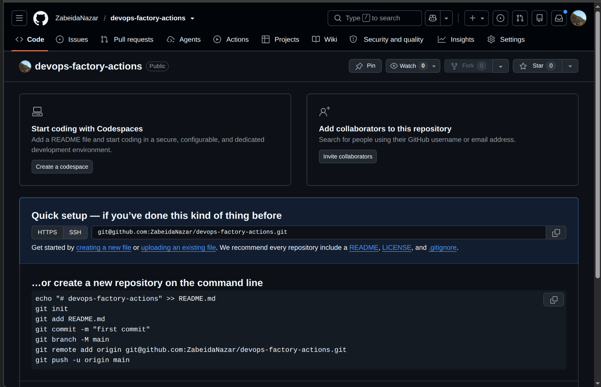
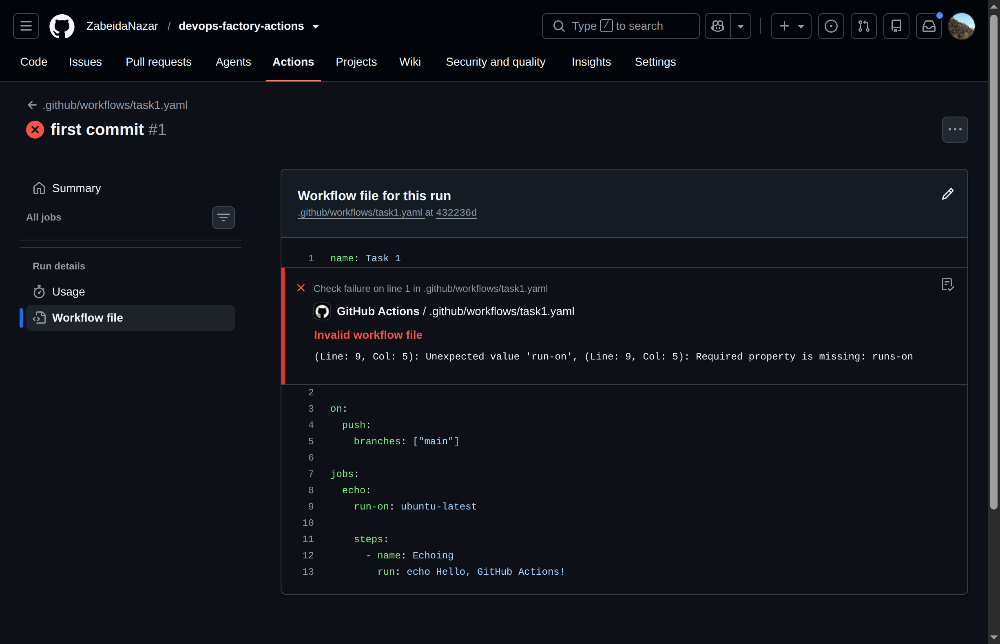
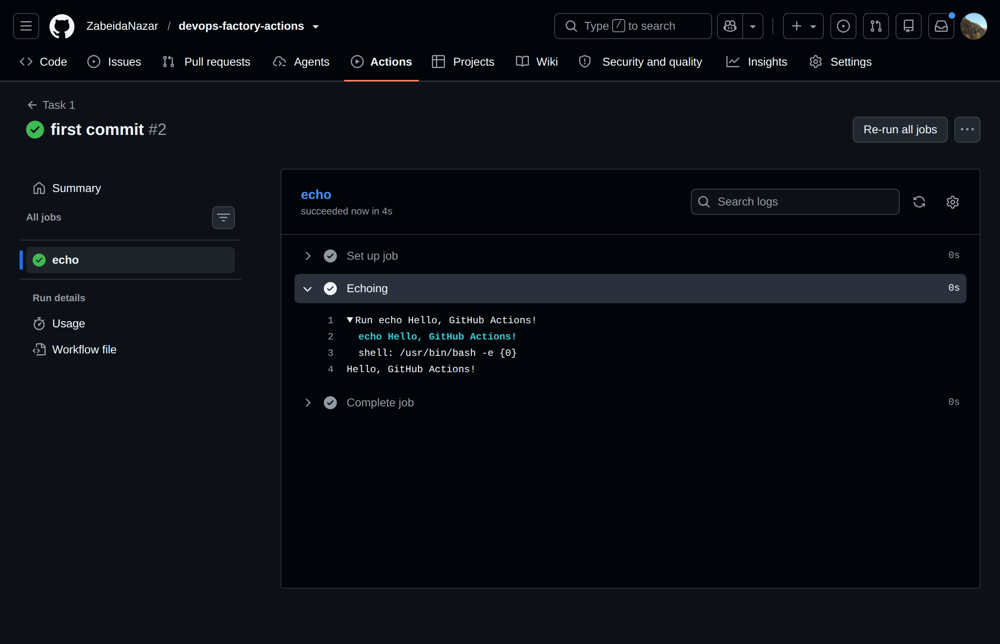

# ДЗ - GitHub Actions

[](https://github.com/ZabeidaNazar/devops-factory-actions/actions)

## Task 1 *: Create a Basic GitHub Actions Workflow
1. Create a new GitHub repository.
- Створено новий репозиторій:

2. Set up a simple workflow that triggers on every push to the main branch.
- Створено новий workflow:
[task1.yaml](.github/workflows/task1.yaml)
3. The workflow should display a basic message in the console, such as Hello, GitHub Actions!.
- Команда для виведення повідомлення: `echo Hello, GitHub Actions!`
4. Push your changes to the main branch and verify the workflow executes successfully
- Створив локальний репозиторій:
```sh
git init
```
- Додав віддалений репозиторій, створений на GitHub:
```sh
git branch -M main
git remote add origin git@github.com:ZabeidaNazar/devops-factory-actions.git
```
- Запушив зміни до репозиторію:
```sh
git push -u origin main
```
- Перша спроба не вдалася - зробив помилку у task1.yaml файлі:

- Виправив помилку і зробив форс пуш:
```sh
git add .github/workflows/task1.yaml
git commit --amend
git push origin +main
```
- Результат:


## Task 2 **: Add Unit Testing with Coverage ≥70%
1. Add the provided Python application (myapp/app.py) and write two functions:
    1. add(a, b) that adds two numbers.
    2. subtract(a, b) that subtracts the second number from the first.
2. Create a test suite (tests/test_app.py) using pytest. Ensure the tests cover at least 70% of the code.
3. Update the workflow to:
    1. Install dependencies from requirements.txt.
    2. Run the tests with pytest and fail the workflow if coverage is below 70%.
    3. Upload a coverage report as an artifact for inspection.
4. Create a pull request to the develop branch and verify the workflow.